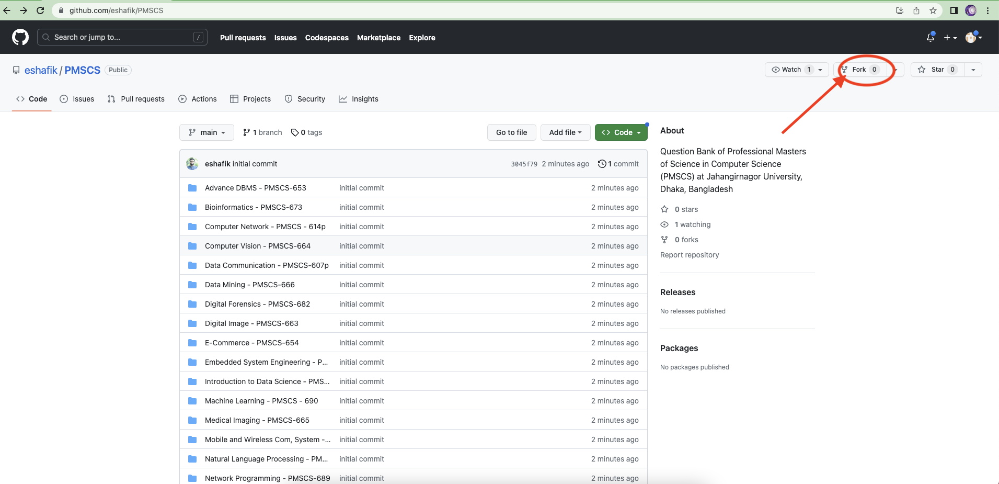

# Question Bank of Professional Masters of Science in Computer Science (PMSCS) at Jahangirnagor University, Dhaka, Bangladesh

## Do you want to contribute by updating the question bank??? Then follow the steps below- 


### Step: 1:

#### Login to your github account first and then fork this github repository (Link: https://github.com/eshafik/PMSCS)



### Step-2: 

#### After fork this git repository you will get it in your github account. Then follow the following steps
- ```git clone https://github.com/eshafik/PMSCS.git```
- ```git checkout -b your-branch-name```
- Update question bank as your need from your laptop
- `git add .`
- `git commit -m " put your message here "`
- `git push origin your-branch-name`

### Step-3:
#### Goto the link: (https://github.com/eshafik/PMSCS). Make a pull request with your branch to the **main** branch.


### Then done!!!

